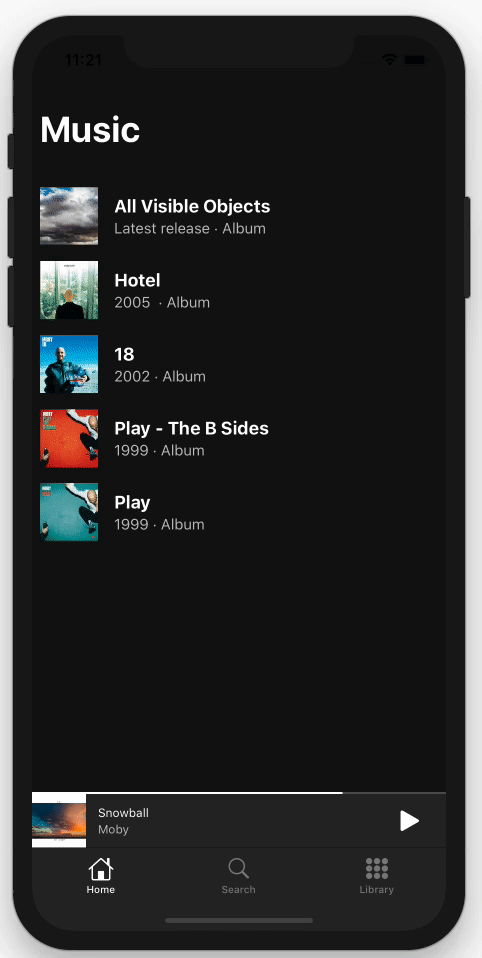

# 
SpotifyPlayer

This is the demo project of the article written in [my blog](https://onswiftwings.com/posts/interactive-animations/). It shows how to create interactive animations using UIViewPropertyAnimator.

  

